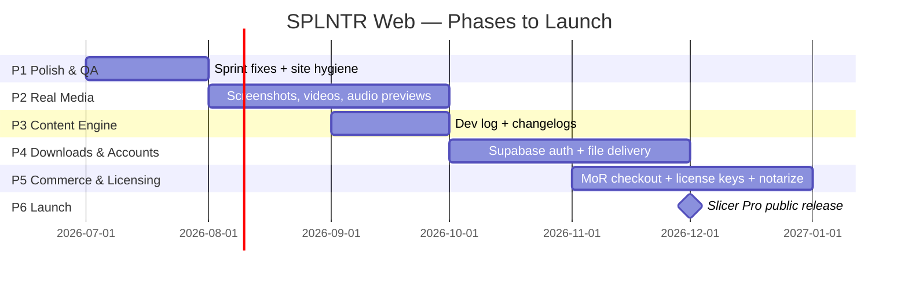

# SPLNTR Web — Development Plan & Roadmap

**Version 1.2 · July 2026**
**Goal:** Take splntr.com from its current deployed state to a public launch platform ready for the first product release (SPLNTR Slicer Pro, Fall 2026) — with real product media, playable audio previews, content downloads, accounts, and commerce.

**Live site:** https://www.splntr-microtools.com/
**Repo:** https://github.com/splntrAVdesigns/SPLNTR_MICROTOOL_SITE
**Stack:** Next.js 14 (App Router) · React 18 · Tailwind 3.4 · Three.js + react-three-fiber · Supabase · Vercel

---

## Current State (Baseline — DONE)

- ✅ Full site deployed on Vercel with custom domain, auto-deploy from GitHub
- ✅ Landing page with signature GLSL terrain hero (v1, proven stable)
- ✅ 4 product pages, Shop page, About, Contact, 4 legal pages (placeholder text)
- ✅ Media carousel (8 generative tiles, video swap-in contract locked)
- ✅ Cursor-tilt cards, color-coded status chips, official SVG logos
- ✅ Waitlist live end-to-end: form → API route → Supabase `waitlist` table (RLS locked)
- ✅ SEO scaffolding: per-page metadata, sitemap.xml, robots.txt, SoftwareApplication JSON-LD
- ✅ **Sprint 1 (Jul 2026):** Slicer Pro card ordered first · domain corrected to splntr-microtools.com · real social links · OG share image (1200×630) · favicon/app icon set + PWA manifest · tailored legal docs (Privacy, Terms, EULA, Refunds) · Slicer Pro page expanded with real product logo + screenshot gallery
- ✅ **Sprint 2 (Jul 2026):** `NEXT_PUBLIC_SITE_URL` set in Vercel (OG/sitemap now resolve to production domain, confirmed live) · mobile hero replaced with a purpose-built CSS wireframe terrain (WebGL proved unreliable on mobile across repeated attempts — see parked item below) · **ProductGallery carousel shipped early from Phase 2** (arrows, thumbnails, keyboard nav, mixed image/video support) · fixed a routing bug where `/products` and `/products/[slug]` page code had been swapped during manual upload, which had been 404-ing the entire Micro Tools section
- 🅿 Parked: audio-reactive hero (diagnostics-first rule), branded email (moved to Phase 5 — see below), community page, press kit, beta-tester quotes, per-product proof strips

---

## Visual Roadmap



```
P1 POLISH ──► P2 MEDIA ──► P3 CONTENT ──► P4 DOWNLOADS ──► P5 COMMERCE ──► 🚀 P6 LAUNCH
  (now)        (Aug)         (Sep)          (Oct)            (Nov)          (Fall '26)
   │             │             │              │                │
   fixes,        real          dev log,       free zips,       pay → license
   domain,       screenshots,  changelogs,    accounts,        → download,
   OG, email     video, audio  SEO flywheel   gated files      notarized app
```

Phases 2 and 3 can overlap. Phase 4 must complete before Phase 5. Phase 5 must complete before launch.

---

## Phase 1 — Polish & QA (NOW · ~1–2 weeks part-time)

The "everything visible works and reads professionally" pass.

**Sprint 1 — SHIPPED (patch 07):**
- [x] Slicer Pro card ordered first (data-driven from `products.ts`)
- [x] Domain corrected → `splntr-microtools.com`; `site.ts` updated
- [x] Branded email `info@splntr-microtools.com` wired site-wide
- [x] Real social links (Instagram, YouTube, Facebook; TikTok pending account)
- [x] OG share image 1200×630 + per-product OG (falls back to default)
- [x] Favicon, apple-touch-icon, 192/512 PWA icons, `manifest.webmanifest` — generated from exact bolt SVG geometry
- [x] Legal pages rewritten and tailored to SPLNTR's model (browser tools + downloadable plugins + beta programs). **Still needs paid-lawyer review of EULA + Refunds before first sale.**
- [x] Slicer Pro page expanded: real product logo, screenshot gallery ("In the studio"), lazy-loaded WebP
- [x] Terrain animation driver hardened (clock-based, not delta-accumulated)

**Sprint 3 — final Phase 1 items:**
- [ ] Confirm mobile terrain hero renders correctly on a real device (patch 09 shipped, needs eyes-on confirmation)
- [ ] TikTok link once the account exists
- [ ] Cross-browser QA re-run incl. incognito (no extensions)
- [ ] Lighthouse baseline on `/` and `/products/slicer-pro`; record scores in this doc

**Definition of done:** No placeholder links or text anywhere a visitor can reach; correct domain everywhere; baseline perf numbers recorded. **Effectively complete pending the mobile-terrain confirmation above.**

### Branded email — parked to Phase 5

Decision: skip for now, revisit before launch when receipts and license keys make deliverability matter. Free custom-domain email is scarce in 2026; options when it's time:

| Option | Cost | Notes |
|---|---|---|
| **Cloudflare Email Routing** | Free | Forwards `info@` → Gmail. Requires moving DNS/nameservers to Cloudflare (standard, low-risk alongside Vercel hosting — just a different DNS manager). Sending *as* the address needs Gmail SMTP setup. |
| **Purelymail / Migadu** | ~$1–3/mo | Cheap real mailboxes, DNS (MX records) stays at Vercel — no nameserver move. |
| **Google Workspace / Microsoft 365** | ~$6–7/user/mo | Full suite, best deliverability — the right call once sending launch/support email at volume. |

Revisit in Phase 5 alongside Resend setup for waitlist announcements.

---

## Phase 2 — Real Product Media (Aug · ~2–4 weeks, overlaps P3)

Replace every placeholder with real product imagery, video, and **playable audio**.

**Media pipeline (decide once, use everywhere):**
- Screenshots: PNG/WebP in `/public/products/<slug>/`, rendered via `next/image`
- Video: H.264 MP4, ≤10 MB per loop, muted/autoplay/loop/playsinline, poster frame required. Store in `/public/media/` while total repo media stays small; move to **Vercel Blob or Supabase Storage + CDN URL** when video count grows (repo bloat + Vercel deploy size are the triggers)
- Every video slot ships with a poster image → nothing ever renders as an empty box

**Tasks:**
- [ ] Homepage carousel: swap generative tiles → real app captures (the `videoSrc` contract in `MediaCarousel.tsx` is already built for this)
- [x] **Product page carousel component DONE** (`ProductGallery.tsx` — arrows, thumbnails, keyboard nav, mixed image/video support, shipped in Sprint 2)
- [ ] Screenshot/clip galleries for BlendCraft, Orbital, Harmony Compass — Slicer Pro's `gallery` array in `products.ts` is the pattern; just add entries (`video: true` for short looping clips)
- [ ] Slicer Pro gallery: expand with close-up/action shots and short looping clips per the carousel design (currently 2 full-UI shots)
- [ ] Per-product OG images as they're assembled (wiring already reads `gallery[0]`, so adding art auto-improves social previews)
- [ ] **AudioPreviewPlayer component (NEW — Slicer Pro core need):**
  - Playable audio snippets so users can sound-check samples on the site
  - HTML5 `<audio>` + Web Audio analyser for a live waveform/progress bar in brand volt-blue; play/pause, scrub, duration; only one snippet plays at a time (global singleton)
  - Files: MP3 128–192kbps (small, universal) in `/public/audio/<slug>/`
  - Reused later by the Shop for sample-pack previews — build it product-agnostic
- [ ] Slicer Pro page: "Hear it" section — 3–6 before/after slice demos using AudioPreviewPlayer

**Definition of done:** Zero placeholder media on any page; Slicer Pro page has playable audio.

---

## Phase 3 — Content Engine (Sep · ~2 weeks, overlaps P2)

The SEO + community flywheel: ship updates publicly, rank for product terms.

- [ ] **Dev Log** (`/news`): MDX files in-repo (simplest; no CMS service needed at this scale) — one post per sprint/release; RSS feed
- [ ] **Changelog per product** (`/products/<slug>/changelog`): data-driven from a `changelogs.ts` file, matching the version-notes convention indie plugin users expect
- [ ] Wire "Dev updates" promise in the waitlist copy to reality (announcement flow: post → email later in P5 via Resend)
- [ ] Add News to nav/footer; JSON-LD Article schema on posts

**Definition of done:** First real dev-log post published; changelog structure live for all 4 products.

---

## Phase 4 — Downloads & Accounts (Oct · ~3–4 weeks)

Infrastructure for delivering files — free content first (no payment complexity), which de-risks the exact plumbing commerce will reuse.

**Download delivery architecture:**
- Files (zips, installers, packs) live in **Supabase Storage** (private buckets)
- Next.js API route issues **short-lived signed URLs** — no direct public file links
- Free content: signed URL issued after email capture (waitlist integration) or freely — per item flag
- Gated content (later): signed URL issued only if the requesting user's account/license qualifies — same route, one extra check
- Download counts logged to a `downloads` table (analytics + abuse visibility)

**Tasks:**
- [ ] Supabase Storage buckets: `free-content/`, `products/` (private)
- [ ] `/api/download/[id]` route: validates → logs → returns signed URL
- [ ] Shop "Free Downloads" category goes functional: first real free pack (sample mini-pack or BlendCraft preset pack) as the pipeline proof
- [ ] **Supabase Auth**: email/password + magic link; `/account` page (profile, download history)
- [ ] Waitlist → account upgrade path (same email links records)

**Definition of done:** A visitor can create an account and download a real free zip via signed URL; downloads are logged.

---

## Phase 5 — Commerce & Licensing (Nov · ~4–6 weeks)

Money + licenses. Everything here reuses Phase 4 plumbing.

- [ ] **Merchant of Record: Lemon Squeezy** (5%+50¢, MoR handles global VAT/sales tax, native license keys, Stripe-owned). Checkout overlay on product pages; webhook → Supabase (`orders`, `licenses` tables)
- [ ] License display in `/account` (key, activation count, download access)
- [ ] Purchased-product downloads via the P4 gated route
- [ ] **macOS distribution (Slicer Pro):** Apple Developer Program ($99/yr) → Developer ID signing + notarization of the .pkg/.dmg — start early, notarization troubleshooting is a known time sink
- [ ] Fully-functional **trial build** delivery (time/feature-limited) — the industry-standard conversion path (Valhalla/Baby Audio pattern)
- [ ] EULA + Refund policy finalized (reviewed) before first sale
- [ ] Launch email tooling: **Resend** + waitlist export → announcement list (double opt-in here)
- [ ] Defer device-fingerprint licensing (Keygen.sh CE / Cryptlex) until piracy is observed — MoR keys suffice at launch

**Definition of done:** Test purchase completes end-to-end: pay → license row → key in account → signed download of notarized installer.

---

## Phase 6 — Launch (Fall 2026)

- [ ] Launch checklist: load test, checkout dry-runs (cards + PayPal), refund dry-run, support email flow, status of all legal pages
- [ ] Analytics (Vercel Analytics + Speed Insights) live ≥2 weeks pre-launch for baseline
- [ ] Press kit page (logo pack, screenshots, boilerplate) — reviewers expect it
- [ ] Beta-tester quotes on Slicer Pro page (collect during beta)
- [ ] Launch sequence: dev-log post → waitlist email → socials → plugin-community posts (KVR, Audio Plugin Guy, r/edmproduction etc.)
- [ ] Week-1 watch: error logs, checkout funnel, download failures, support volume

---

## Cross-Cutting Tracks (ongoing)

| Track | Policy |
|---|---|
| **Performance budget** | Homepage ≥ 85 mobile Lighthouse; hero terrain stays the only WebGL surface; every video has poster + lazy load; re-measure each phase |
| **Sprint discipline** | The BlendCraft loop: scope → patch (changed files only) → Blang QA on real devices → report → next. Root-cause fixes only; features that resist diagnosis get parked with a diagnostics-first re-entry rule (see audio-reactive terrain) |
| **Git hygiene** | Commit per sprint patch; never commit `.env*`; Vercel preview = review surface. Migrate patch application from GitHub web UI → local git + Claude Code when comfortable |
| **Dependency policy** | No `npm audit fix --force`, ever. Planned **Next 15 + React 19 + r3f 9 upgrade sprint** post-launch (clears the outstanding advisories deliberately, with full QA) |
| **Security** | Service-role key server-only; RLS explicit-deny policies on all tables; signed URLs short-lived; review Supabase Security Advisor each phase |
| **Localization** | Post-launch consideration; Next.js i18n routing when a real second-language audience shows in analytics |

## Parked (future developments)

- Audio-reactive hero terrain (diagnostics-first rule documented in README)
- Community page (Discord link-out or embedded forum)
- Per-product "built with our tools" proof strips
- Rent-to-own pricing (FastSpring-style) if price resistance appears
- App subdomain split (`store.` / `app.`) if the account area outgrows the marketing site

---

## Change log

- **v1.2 (Jul 2026)** — Sprint 2/3 shipped (patches 08–10). Fixed critical `/products` routing bug (index/detail page files had been swapped). Mobile hero rebuilt as CSS terrain after WebGL proved unreliable on mobile. ProductGallery carousel shipped early. Branded email formally parked to Phase 5.
- **v1.1 (Jul 2026)** — Sprint 1 shipped (patch 07). Domain corrected to `splntr-microtools.com`. Legal docs tailored. Slicer Pro media live.
- **v1.0 (Jul 2026)** — Initial six-phase plan.

---

*Maintained by Blang + Claude. Update the checkboxes as sprints land; re-version on any phase re-scope.*
